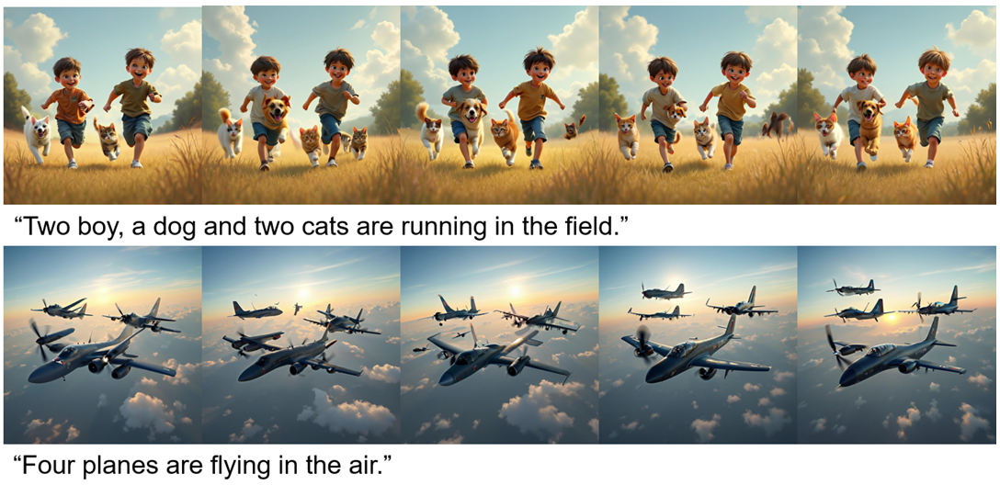
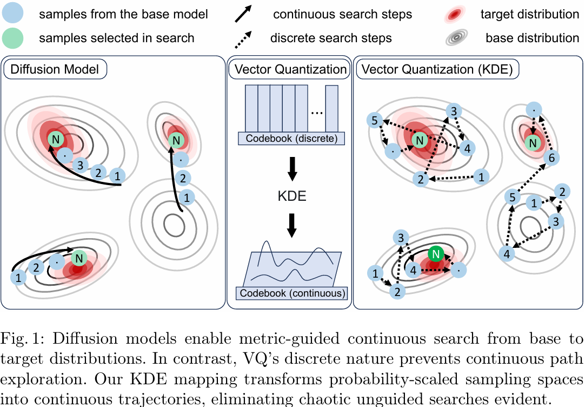
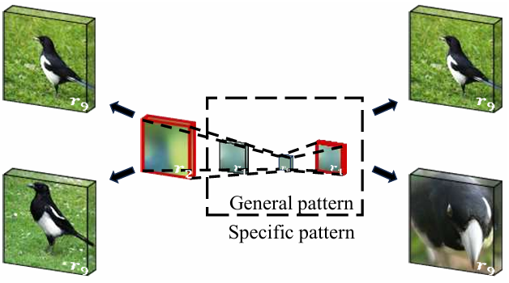
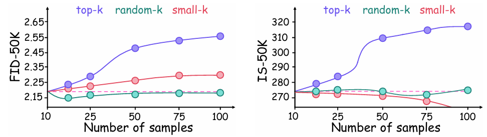
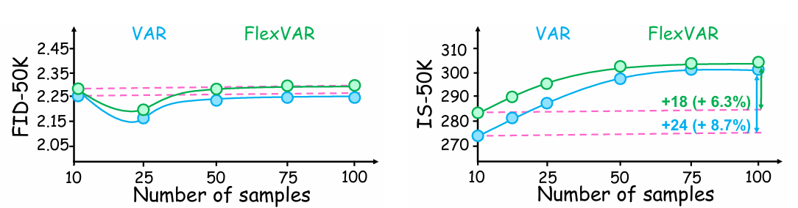
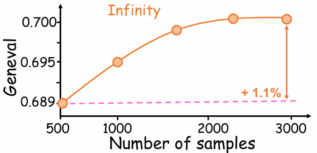

# Inference-Time Scaling for Visual AutoRegressive Modeling by Searching Representative Samples

<div align="center">

[](https://arxiv.org/abs/2601.07293)
[](https://link.springer.com/chapter/10.1007/978-981-95-5699-1_28)
[](LICENSE)

**Weidong Tang, Xinyan Wan, Siyu Li, and Xiumei Wang**

*Xidian University*

</div>

<p align="center">
  
</p>

---

## 📖 Abstract

While inference-time scaling has significantly enhanced generative quality in large language and diffusion models, its application to vector-quantized (VQ) visual autoregressive modeling (VAR) remains unexplored. We introduce VAR-Scaling, the first general framewor for inference-time scaling in VAR, addressing the critical challenge of discrete latent spaces that prohibit continuous path search. We find that VAR scales exhibit two distinct pattern types: general patterns and specific patterns, where later-stage specific patterns conditionally optimize early-stage general patterns. To overcome the discrete latent space barrier in VQ models, we map sampling spaces to quasi-continuous feature spaces via kernel density estimation (KDE), where high-density samples approximate stable, high-quality solutions. This transformation enables effective navigation of sampling distributions. We propose a density adaptive hybrid sampling strategy: Top-k sampling focuses on high-density regions to preserve quality near distribution modes, while Random-k sampling explores low-density areas to maintain diversity and prevent premature convergence. Consequently, VAR-Scaling optimizes sample fidelity at critical scales to enhance output quality. Experiments in class-conditional and text-to-image evaluations demonstrate signifcant improvements in inference process.

<div align="center">
  
  <p><em>Figure 1: Comparison with Diffusion Models. While diffusion models enable metric-guided continuous search, VQ's discrete nature prevents this. Our KDE mapping transforms probability-scaled sampling spaces into continuous trajectories.</em></p>
</div>

## 💡 Methodology & Analysis

### 1. Pattern Evolution: General vs. Specific
Our approach is grounded in the observation that VAR's multi-scale generation process exhibits two distinct phases. Inspired by the in-depth analysis in **[Why Next-Scale Prediction Outperforms Diffusion Models?](https://zhouyifan.net/2024/12/21/20241218-VAR/)** by Yifan Zhou, we categorize these into:

*   **General Patterns (Scales 0-1):** Define the global spatial structure, contours, and semantics.
*   **Specific Patterns (Scales 2-9):** Progressively refine local details, textures, and edges.

<div align="center">
  
  <p><em>Figure 2: Visualization of Pattern Evolution. Scales 0-1 establish the foundational "General Patterns," while subsequent scales (2-9) fill in the "Specific Patterns." Our scaling strategy is designed to optimize these critical transition points.</em></p>
</div>

### 2. Density Analysis
To determine the optimal sampling strategy for these patterns, we explored the correlation between sample density in the quasi-continuous space and generation quality.

<div align="center">
  
  <p><em>Figure 3: Experimental analysis of sample density. We find that high-density regions correspond to high-quality representative prototypes (ideal for General Patterns), whereas low-density samples often result in outliers or diverse variations.</em></p>
</div>

### 3. VAR-Scaling Strategy
Based on these findings, we propose a density-adaptive framework:
1.  **Map** discrete samples to a quasi-continuous space using Kernel Density Estimation (KDE).
2.  **Identify** high-density regions as representative prototypes.
3.  **Apply** Hybrid Sampling:
    *   **Top-k** for high-density regions (to preserve quality/structure).
    *   **Random-k** for low-density regions (to maintain diversity).

    

## 🚀 News
- **[2026.01.16]** Code released! Support for both **VAR** and **Infinity** baselines.
- **[2025.08.23]** Paper accepted to **PRCV 2025**!

## 📂 Repository Structure

This repository contains the official implementation of VAR-Scaling applied to two strong baselines:

*   **[VAR](./VAR)**: Implementation on the original VAR model (Class-Conditional, ImageNet).
*   **[Infinity](./Infinity)**: Implementation on the high-resolution Infinity model (Text-to-Image).

## 🛠️ Installation

To ensure full compatibility and reproducibility, we recommend following the official installation guides for the respective base models.

*   **For VAR:** Please refer to [FoundationVision/VAR](https://github.com/FoundationVision/VAR).
*   **For Infinity:** Please refer to [FoundationVision/Infinity](https://github.com/FoundationVision/Infinity).

Once you have set up the environment for the base model, simply navigate to the corresponding folder in this repository (`./VAR` or `./Infinity`) and run our provided scripts.

## ⚡ Usage

### 1. VAR (Class-Conditional)

For the original VAR model (ImageNet generation), use the provided `run.py` script.

**Step 1: Prepare Checkpoints**
Ensure you have the ImageNet checkpoints (`var_d30.pth`, `vae_ch160.pth`).

**Step 2: Run Inference**

```bash
cd VAR

python run.py \
  --vae_ckpt path/to/vae_ch160.pth \
  --var_ckpt path/to/var_d30.pth \
  --output_dir ./output_images \
  --model_depth 30 \
  --enable_scaling \
  --scaling_scale 1 \
  --scaling_samples 50 \
  --scaling_alpha 2.3
```

**Key Parameters:**
*   `--enable_scaling`: Activates the scaling strategy.
*   `--scaling_scale`: The specific scale index to apply scaling (Scale 1 is recommended for VAR).
*   `--scaling_alpha`: Density threshold coefficient.


### 2. Infinity (Text-to-Image)

We provide a comprehensive script `eval.sh` to reproduce our results on the Infinity model.

**Step 1: Prepare Weights**
Download the required weights (`infinity_2b_reg.pth`, `infinity_vae_d32reg.pth`, `flan-t5-xl`) and place them in `Infinity/weights/`.

**Step 2: Run Inference**

```bash
cd Infinity

# Run the evaluation script with VAR-Scaling enabled
bash eval.sh
```

**Configuration:**
The `eval.sh` script is pre-configured with the best parameters:
```bash
# === VAR-Scaling Parameters ===
ENABLE_SCALING=1          # Enable VAR-Scaling
SCALING_LAYER_IDX=3       # Apply search at the critical layer (Scale 3)
SCALING_NUM_SAMPLES=3000  # Number of candidates for density estimation
```


## 📊 Results

### Quantitative Results
VAR-Scaling achieves significant improvements in **FID**, **IS**, and **GenEval** scores across different scales compared to baseline strategies (Random-k, Top-k).

<div align="center">
  
  <p><em>Figure 4: FID and IS scores on ImageNet-50k. VAR-Scaling (Purple line) achieves the best trade-off between quality and diversity.</em></p>
</div>
<br>
<div align="center">
  
  <p><em>Figure 5: GenEval improvement on Infinity model with scaling samples.</em></p>
</div>

## 🔗 Citation

If you find our work helpful, please cite:

```bibtex
@inproceedings{tang2025inference,
  title={Inference-Time Scaling for Visual AutoRegressive modeling by Searching Representative Samples},
  author={Tang, Weidong and Wan, Xinyan and Li, Siyu and Wang, Xiumei},
  booktitle={Pattern Recognition and Computer Vision (PRCV)},
  year={2025},
  publisher={Springer},
  note={arXiv:2601.07293}
}
```

## 🙏 Acknowledgments

This codebase is built upon [VAR](https://github.com/FoundationVision/VAR) and [Infinity](https://github.com/FoundationVision/Infinity). We thank the authors for their outstanding open-source contributions.

The analysis of General vs. Specific patterns in VAR was inspired by:
- Yifan Zhou. (2024). *NIPS 2024 Best Paper VAR In-Depth Analysis: Why Next-Scale Prediction Outperforms Diffusion Models?*. [Blog Post](https://zhouyifan.net/2024/12/21/20241218-VAR/).